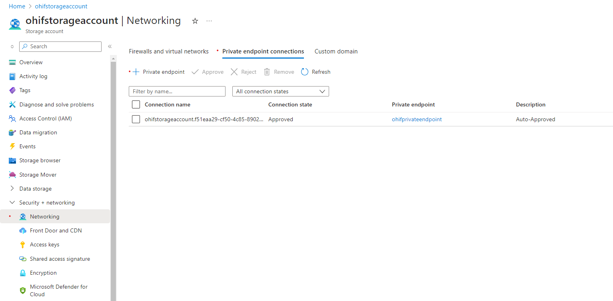
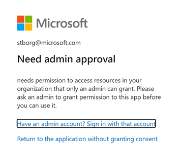

# Azure DICOM service with OHIF viewer

[OHIF Viewer](https://ohif.org/) is a open source non-diagnostic DICOM viewer that uses DICOMweb API's to find and render DICOM images.

This project provides guidence on deployment of [OHIF Viewer](https://ohif.org/) on Azure and configurations needed to work with Azure Health Data Services DICOM service .

## Steps
### Create a new Azure Health Data DICOM service
- Create a [Azure Health Data services workspace](https://docs.microsoft.com/en-us/azure/healthcare-apis/healthcare-apis-quickstart).
- Create a [DICOM service](https://docs.microsoft.com/en-us/azure/healthcare-apis/dicom/deploy-dicom-services-in-azure). Go to the newly created resource.
- Make a note of the `Service URL` (the URL to the newly created DICOM service), it will be used in a later step.
- [Assign roles](https://docs.microsoft.com/en-us/azure/healthcare-apis/configure-azure-rbac#assign-roles-for-the-dicom-service) to yourself or users accessing OHIF viewer to provide read write access using "DICOM Data Owner" Role.
- Set [CORS](https://learn.microsoft.com/en-us/azure/healthcare-apis/dicom/configure-cross-origin-resource-sharing) on DICOM service created in the previous step to allow web URL's that can access the service.

### Register an application with Microsoft Identity platform
- [Register a new application](https://docs.microsoft.com/en-us/azure/active-directory/develop/quickstart-register-app#register-an-application). Choose <b>Accounts in this organizational directory only</b> for who can access and skip Redirect URI.
- [Grant scoped permission](https://docs.microsoft.com/en-us/azure/healthcare-apis/register-application) to the DICOM service
    - <b>Skip</b> Certificates and secrets, since we will use delegated/on-behalf of workflow
    - <b>Grant admin consent</b> for your org to use the API. <b>Verify the green check in the diagram is checked. </b>
    - 
- Make a note of the `Application (client) ID`, it will be used in a later step.
- Make a note of the Azure Active Directory `Directory (tenant) ID`, it will be used in a later step. (It can also be found on the root Overview page of your Azure Active Directory. There it is listed as `Tenant ID`.)
- Leave this browser tab open, as it will be used to add a redirect URI in a later step.

### Deploy OHIF Viewer on Azure Storage Static Website 

- Click on the button to deploy a new Storage Account and configure it to host OHIF.   

    Provide the following inputs:

    | Parameter | Value | Description |
    | ------------- | ----- | ----------- |
    | Subscription | user provided | Desired subsciption to host the OHIF viewer 
    | Resource Group | user provided | Desired Resource Group name. May be a new or existing.
    | Region | user provided | Desired Azure Region to host the Resource Group and Storage account website.
    | Storage Account Name | user provided | Desired name of storage account. This will appear in the OHIF URL.
    | Dicom Service Url | `Service URL` | Existing DICOM service URL (noted above) 
    | Aad Teanant Id | `Directory (tenant) ID` | Existing Azure subscription AAD Tenant Id (noted above)
    | Application Client ID  | `Application (client) ID` | Existing Application Client ID (noted above)
    | CDN Name  | user provided | Desired name for the cdn instance

- Make a note of the `cdnEndpoint` from the ARM deployment output variable. (You can find the output variables on the left-hand column, once the custom ARM template has successfully completed creating resources.)

#### Enabling OHIF Viewer on a Private Link enabled workspace
If your Dicom service is in an Azure Health Data Services workspace with private link enabled then you will need to configure a few things in the storage account created in the previous step.
- Navigate to the storage account that was created as part of the deployment of OHIF viewer from the previous step
- Add a new private endpoint (`Security + Networking` > `Networking` > `Private Endpoint Connections` > `+ Private Endpoint`) to the same vnet and subnet as your Dicom service. The target resource should be `web`.
  
- Disable public network access (`Security + Networking` > `Networking` > `Firewalls and virtual networks` > `Private Endpoint Connections` > `Public Network Acccess` > `Disabled`)
  

Once the remainder of the following steps are completed you will be able to access the OHIF viewer on a device connected to the same virtual network.

### Complete the configuration of the application created earlier
- Go back to browser tab with the AAD application created earlier (or reopen if necessary).
- [Add a redirect URI](https://docs.microsoft.com/en-us/azure/active-directory/develop/quickstart-register-app#add-a-redirect-uri) to the OHIF viewer callback url to pass the token the web app.
    - Under Configure platforms, select the <b>Web</b> tile.
    - Specify the redirect URI to <b>https://%cdnEndpoint%/callback</b>. 
    - Select "Access tokens" and "ID tokens" flow.
    - 

> Note: If you receive a `Need admin approval` (as below), ensure you have green check in the Status column of of the Configured Permissions of your application. (See `Register an application with Microsoft Identity platform` section above.) In some organizations, this may require a separate, and potentially manual, process for approval.

> 

### Test the installation
- Browse to the `cdnEndpoint` to access OHIF viewer

> You can do additional Domain and CDN configurations as need.

## Contributing

This project welcomes contributions and suggestions.  Most contributions require you to agree to a
Contributor License Agreement (CLA) declaring that you have the right to, and actually do, grant us
the rights to use your contribution. For details, visit https://cla.opensource.microsoft.com.

When you submit a pull request, a CLA bot will automatically determine whether you need to provide
a CLA and decorate the PR appropriately (e.g., status check, comment). Simply follow the instructions
provided by the bot. You will only need to do this once across all repos using our CLA.

This project has adopted the [Microsoft Open Source Code of Conduct](https://opensource.microsoft.com/codeofconduct/).
For more information see the [Code of Conduct FAQ](https://opensource.microsoft.com/codeofconduct/faq/) or
contact [opencode@microsoft.com](mailto:opencode@microsoft.com) with any additional questions or comments.

## Trademarks

This project may contain trademarks or logos for projects, products, or services. Authorized use of Microsoft 
trademarks or logos is subject to and must follow 
[Microsoft's Trademark & Brand Guidelines](https://www.microsoft.com/en-us/legal/intellectualproperty/trademarks/usage/general).
Use of Microsoft trademarks or logos in modified versions of this project must not cause confusion or imply Microsoft sponsorship.
Any use of third-party trademarks or logos are subject to those third-party's policies.
