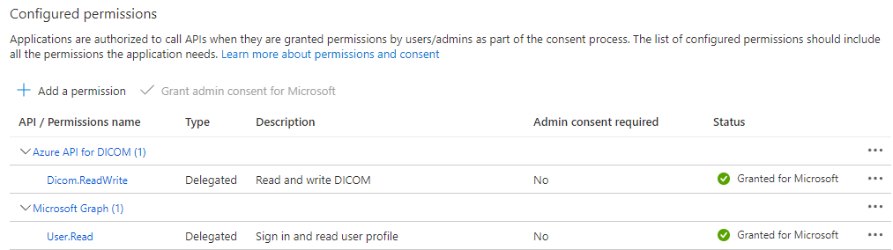
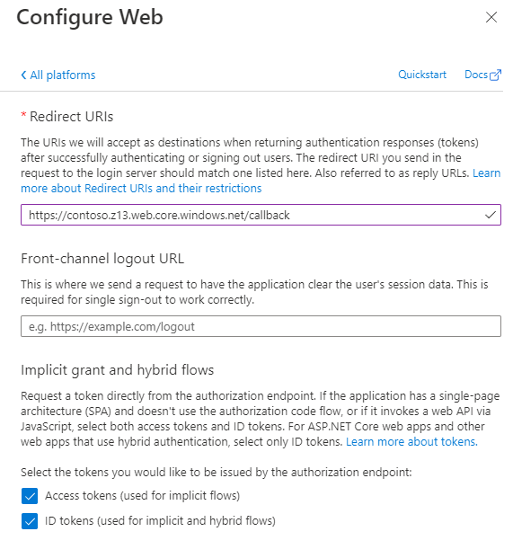

# Azure DICOM service with OHIF viewer

[OHIF Viewer](https://ohif.org/) is a open source non-diagnostic viewer that uses DICOMWeb API's to find and render DICOM images.

This project provides guidence on deployment of [OHIF Viewer](https://ohif.org/) on Azure and configurations needed to work with Azure Health Dicom service .

## Steps
### Create a new Azure Health Data DICOM service
- Create a [Azure Health Data services workspace](https://docs.microsoft.com/en-us/azure/healthcare-apis/healthcare-apis-quickstart).
- Create a [DICOM service](https://docs.microsoft.com/en-us/azure/healthcare-apis/dicom/deploy-dicom-services-in-azure). Go to the newly created resource and remember the `Service URL`.
- [Assign roles](https://docs.microsoft.com/en-us/azure/healthcare-apis/configure-azure-rbac#assign-roles-for-the-dicom-service) to provide read write access using "DICOM Data Owner" Role.
- [TODO] Enable CORs

### Register an application with Microsoft Identity pltaform
- [Register a new application](https://docs.microsoft.com/en-us/azure/active-directory/develop/quickstart-register-app#register-an-application). Choose <b>Accounts in this organizational directory only</b> for who can access and skip Redirect URI.
- [Grant scoped permission](https://docs.microsoft.com/en-us/azure/healthcare-apis/register-application) to the Dicom service
    - <b>Skip</b> Certificates and secrets, since we will use delegated/on-behalf of workflow
    - <b>Grant admin consent for your org to use the API</b>
    - 
- [Add a redirect URI](https://docs.microsoft.com/en-us/azure/active-directory/develop/quickstart-register-app#add-a-redirect-uri) to the OHIF viewer callback url to pass the token the web app.
    - Under Configure platforms, select the <b>Web</b> tile.
    - Specify the redirect URI to <b>%weburl%/callback</b>. Replace %weburl% after Deploying OHIF in the next step. 
    - Select "Access tokens" and "ID tokens" flow.
    - 
- Remember the `Application\Client ID`

### Deploy OHIF Viewer on Azure Storage Static Website 

- Click on the button to deploy storage Account </br> <a href="https://portal.azure.com/#create/Microsoft.Template/uri/https%3A%2F%2Fraw.githubusercontent.com%2Fmicrosoft%2Fdicom-ohif%2Fmain%2Ftemplates%2Fdeploy-ohif-azure.json" target="_blank"></a>
- Use Azure portal Cloud shell to run below commands to copy the OHIF viewer content to cloud and configure it.

```cmd
# Copy Static website content
blobUrl="https://$storageAccountName.blob.core.windows.net/\$web/"
azcopy rm $blobUrl --recursive=true --include-pattern="*"
azcopy copy "build/*" $blobUrl --recursive

# Ensure static webhosting is enabled
az storage blob service-properties update --static-website true --index-document "index.html" --404-document "index.html" --account-name $storageAccountName --auth-mode login
```
- Update properties in app.config. 
- Go back to AAD application to replace the <b>%weburl%</b> with the ARM deployment output <b>storageAccountWebEndpoint</b>.
- Browse to the blobUrl to access OHIF viewer


| You can do additional Domain and CDN configurations as need.

## Contributing

This project welcomes contributions and suggestions.  Most contributions require you to agree to a
Contributor License Agreement (CLA) declaring that you have the right to, and actually do, grant us
the rights to use your contribution. For details, visit https://cla.opensource.microsoft.com.

When you submit a pull request, a CLA bot will automatically determine whether you need to provide
a CLA and decorate the PR appropriately (e.g., status check, comment). Simply follow the instructions
provided by the bot. You will only need to do this once across all repos using our CLA.

This project has adopted the [Microsoft Open Source Code of Conduct](https://opensource.microsoft.com/codeofconduct/).
For more information see the [Code of Conduct FAQ](https://opensource.microsoft.com/codeofconduct/faq/) or
contact [opencode@microsoft.com](mailto:opencode@microsoft.com) with any additional questions or comments.

## Trademarks

This project may contain trademarks or logos for projects, products, or services. Authorized use of Microsoft 
trademarks or logos is subject to and must follow 
[Microsoft's Trademark & Brand Guidelines](https://www.microsoft.com/en-us/legal/intellectualproperty/trademarks/usage/general).
Use of Microsoft trademarks or logos in modified versions of this project must not cause confusion or imply Microsoft sponsorship.
Any use of third-party trademarks or logos are subject to those third-party's policies.
